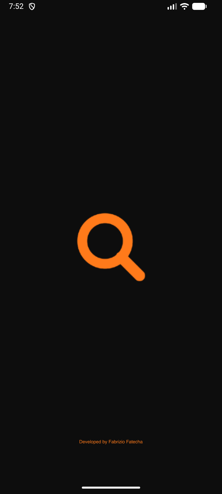
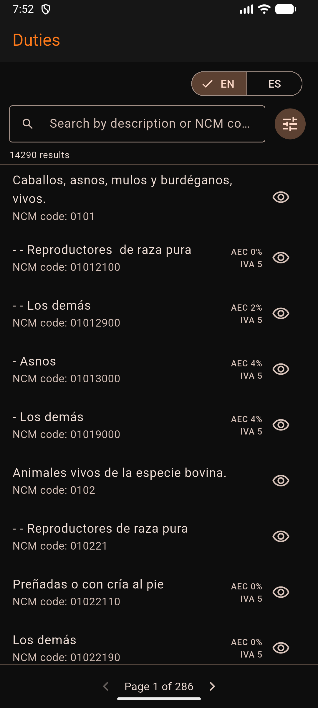

<div align="center">
  

  # Duties

  ### Búsqueda offline de códigos arancelarios NCM, al instante

  Más de **14,000 registros** del arancel de importaciones de Ecuador — tasas AEC, IVA y régimen —
  sin necesidad de conexión a internet.

  [](https://duties-website.netlify.app)
  [](https://github.com/fabrizio-fatecha/duties/releases/latest/download/duties.apk)

</div>

<br>

<p align="center">
  
  &nbsp;&nbsp;
  
</p>

## Qué hace

Duties carga el arancel de importaciones completo (CSV) directo en el teléfono y lo indexa en
memoria, así que buscar y filtrar es instantáneo — sin backend, sin conexión, sin esperas.

- **🔍 Búsqueda instantánea** — por descripción o código NCM, con debounce y sin distinción de mayúsculas.
- **🎛️ Filtros combinables** — tasa AEC, IVA y régimen especial, todos con lógica AND, agrupados en un panel único.
- **👁️ Detalle completo** — tocá el ícono de ojo para ver todos los campos de un registro, con un botón para copiarlos al portapapeles.
- **📄 Paginación real** — 50 resultados por página, nada de listas infinitas que se cuelgan.
- **🌐 Bilingüe** — español e inglés, con un switch en la pantalla principal.
- **🔄 Actualizaciones OTA** — integrado con [Shorebird](https://shorebird.dev) para recibir parches sin pasar por la tienda de aplicaciones.

## Stack

Flutter · Provider · [`csv`](https://pub.dev/packages/csv) para parseo en background isolate ·
`flutter_launcher_icons` / `flutter_native_splash` para branding nativo · Shorebird para code push.

## Correrlo localmente

```bash
flutter pub get
flutter run
```

El dataset vive en `assets/data.csv` y se indexa una sola vez al arrancar
(`DataRepository`), armando un mapa de valor → índices por cada campo filtrable
para que el filtrado sea O(1) en vez de recorrer los 14,000 registros por tecla.

## Estructura

```
lib/
  models/         modelo tipado de cada fila del CSV
  services/       carga del CSV (en isolate) + indexado/búsqueda
  providers/      estado de búsqueda/filtros e idioma (Provider)
  screens/        pantalla principal
  widgets/        campo de búsqueda, panel de filtros, detalle de registro, etc.
website/          sitio promocional estático (desplegado en Netlify)
docs/             notas de setup (Shorebird) y capturas
```

## Releases

Cada release de GitHub incluye el APK listo para instalar
([`duties.apk`](https://github.com/fabrizio-fatecha/duties/releases/latest)).
El sitio web siempre apunta a la última versión publicada.

---

<div align="center">
  Developed by <strong>Fabrizio Fatecha</strong>
</div>
